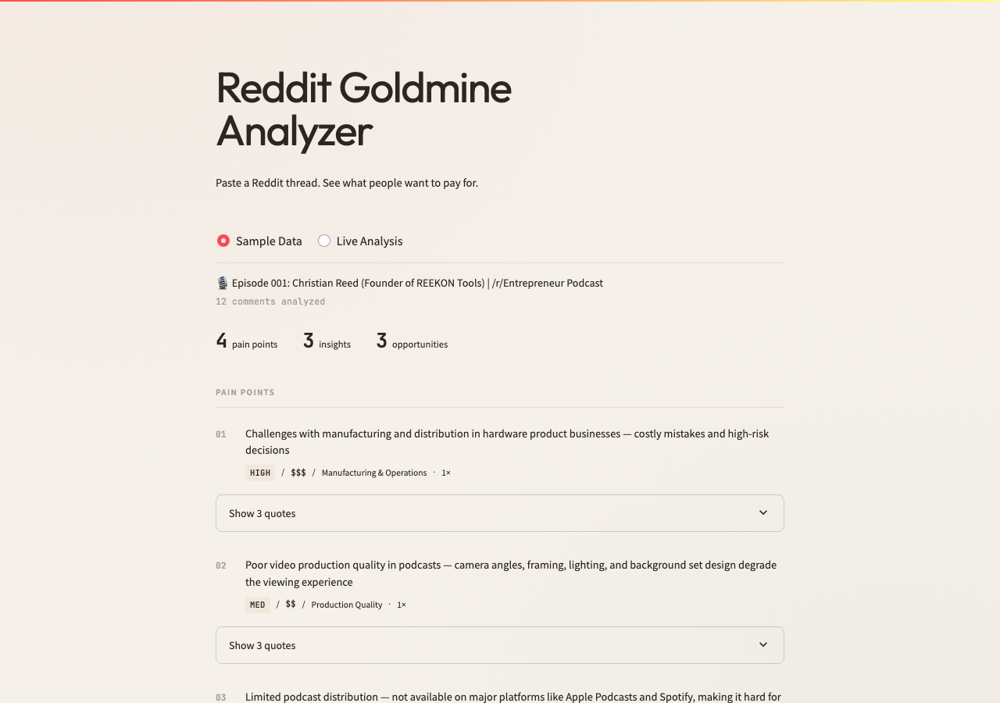

<div align="center">

# Reddit Goldmine Analyzer

**Turn Reddit threads into actionable market insights with AI**

Discover customer pain points, purchase intent, and market opportunities — at scale.

[](LICENSE)
[](https://www.python.org/)

[Web Demo](#-web-demo) · [CLI Usage](#-cli-usage) · [Quick Start](#-quick-start) · [日本語](README_ja.md)

</div>

---

## What It Does

Give it any Reddit thread URL → get a structured analysis of what people *actually* want to pay for.

**Example output** (from a real r/Entrepreneur thread):

| Pain Point | Severity | Purchase Intent | Category |
|---|---|---|---|
| Manufacturing & distribution challenges for hardware startups | 🟠 HIGH | 💰💰💰 HIGH | Manufacturing & Operations |
| Poor video production quality in podcasts | 🟡 MEDIUM | 💰💰 MEDIUM | Production Quality |
| Limited podcast distribution across platforms | 🟡 MEDIUM | 💰 LOW | Distribution & Access |

Plus: **key insights**, **market opportunities**, and **sentiment analysis** — all extracted automatically.

---

## How It Works

```
1. Fetch    →  Grab any Reddit thread via the public JSON API (no auth needed)
2. Analyze  →  AI extracts pain points, purchase intent & market opportunities
3. Report   →  Get a prioritized, actionable report (Markdown + JSON)
```

**Architecture:**

```
Reddit URL → reddit_fetcher.py → ai_analyzer.py → Report (MD + JSON)
                                         ↑
                                   OpenAI / GPT-4.1
```

---

## Web Demo

Try it instantly in your browser — **no API key required** for the sample data mode.

```bash
pip install -r requirements.txt
streamlit run app.py
```



**Features:**
- **Sample Data Mode** — explore pre-analyzed results instantly, no API key needed
- **Live Analysis Mode** — enter your OpenAI API key + any Reddit URL for real-time analysis
- Color-coded severity and purchase intent badges
- Expandable example comments
- One-click download of analysis results

---

## CLI Usage

### Analyze a single thread

```bash
python goldmine_finder.py --url "https://www.reddit.com/r/Entrepreneur/comments/xxx/"
```

### Scan an entire subreddit

```bash
python goldmine_finder.py --subreddit Entrepreneur --limit 10 --min-comments 5
```

### Batch analyze multiple URLs

```bash
python goldmine_finder.py --batch urls.txt --output my_analysis/
```

**Output files:**
- `thread_xxx.json` — raw thread data
- `analysis_xxx.json` — structured AI analysis
- `report_xxx.md` — human-readable report
- `summary_xxx.md` — cross-thread summary (subreddit/batch mode)

---

## Quick Start

### 1. Clone & install

```bash
git clone https://github.com/yu010101/reddit_goldmine_analyzer.git
cd reddit_goldmine_analyzer
pip install -r requirements.txt
```

### 2. Try the demo (no API key needed)

```bash
python demo.py
```

### 3. Run the Web UI (no API key needed for sample data)

```bash
streamlit run app.py
```

### 4. Analyze live data (requires OpenAI API key)

```bash
export OPENAI_API_KEY="your-key-here"
python goldmine_finder.py --url "https://www.reddit.com/r/SaaS/comments/xxx/"
```

---

## Project Structure

```
reddit_goldmine_analyzer/
├── app.py                 # Streamlit Web UI
├── goldmine_finder.py     # CLI tool (main entry point)
├── reddit_fetcher.py      # Reddit JSON API fetcher
├── ai_analyzer.py         # AI analysis engine
├── demo.py                # Quick demo script
├── examples/              # Sample data (works without API key)
│   ├── sample_thread.json
│   ├── sample_analysis.json
│   └── sample_report.md
├── docs/                  # Documentation (Japanese)
├── requirements.txt
├── LICENSE
├── README.md              # This file (English)
└── README_ja.md           # Japanese README
```

---

## Configuration

### AI Model

```python
# In ai_analyzer.py or via the web UI
analyzer = AIAnalyzer(model="gpt-4.1-mini")   # Default (balanced)
analyzer = AIAnalyzer(model="gpt-4.1-nano")   # Faster & cheaper
```

### Rate Limiting

```python
fetcher = RedditFetcher()
fetcher.rate_limit_delay = 3  # seconds between requests (default: 2)
```

---

## Cost

- ~$0.01–0.05 per thread analysis (GPT-4.1-mini)
- Reddit API is free (public JSON endpoint, no auth required)

---

## License

[MIT](LICENSE)

---

## Contributing

Issues and pull requests are welcome!

---

<div align="center">

**Happy Goldmining!** ⛏️

</div>
